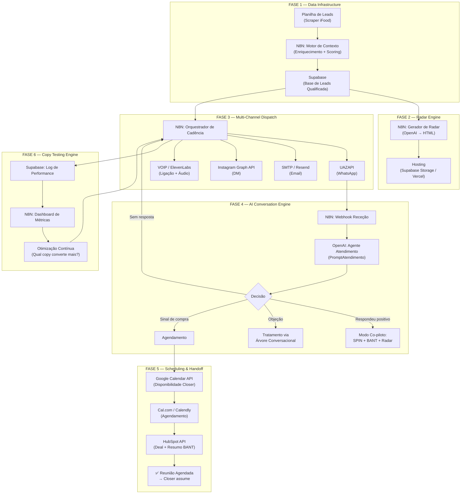

# Plano de Construção — Agente SDR Outbound Autônomo NOLA

> **Objetivo**: Construir o SDR Outbound mais eficiente do Brasil — 100% autônomo, zero intervenção humana, do mapeamento do lead até a reunião agendada no calendário do Closer.

---

## Visão Geral da Arquitetura



---

## Tech Stack Definida

| Componente | Ferramenta | Por quê |
|-----------|-----------|---------|
| **Orquestração** | N8N (self-hosted) | Vocês já usam. Flows visuais, webhooks, sub-workflows |
| **LLM Principal** | OpenAI GPT-4o | Melhor relação qualidade/custo pra geração de texto. Usar com temperature 0.7-0.9 pra variação |
| **WhatsApp** | UAZAPI (self-hosted) | Já em uso. Suporta texto, áudio PTT, imagem, vídeo, listas, botões, webhooks, delay/readchat nativos. Integração N8N via HTTP. Documentação PT-BR |
| **Email** | Resend ou SMTP | Deliverability alta, templates HTML, tracking de abertura |
| **CRM** | HubSpot (já em uso) | Pipeline, deals, contacts, atividades, automações |
| **Database** | Supabase (PostgreSQL) | Base de leads, log de conversas, métricas de copy testing, estado da cadência |
| **Hosting Radar** | Supabase Storage ou Vercel | HTML estático, URL pública, carregamento instantâneo |
| **Agenda** | Google Calendar API + Cal.com | Disponibilidade real do Closer, link de agendamento automático |
| **Áudio/Voz** | ElevenLabs API | Voice cloning do SDR real → gera áudios personalizados automaticamente |
| **Imagens** | Template HTML → Screenshot API (Browserless) | Gera cards visuais do Radar automaticamente |
| **Vídeo** | HeyGen ou Synthesia (ou vídeo pré-gravado) | Vídeos com avatar ou vídeo genérico reutilizável |

---

## As 6 Fases de Construção

---

### FASE 1: Data Infrastructure — A Base de Tudo

> **Duração estimada**: 1 semana
> **Resultado**: Base de leads qualificada, enriquecida e priorizada em Supabase

#### O Que Construir

**1.1 — Tabela de Leads no Supabase**

```sql
CREATE TABLE leads (
  id UUID PRIMARY KEY DEFAULT gen_random_uuid(),
  
  -- Dados básicos (do scraper)
  nome TEXT NOT NULL,
  nome_negocio TEXT NOT NULL,
  telefone TEXT,
  email TEXT,
  cnpj TEXT,
  cuisine TEXT,
  price_range TEXT,
  rating DECIMAL(2,1),
  endereco TEXT,
  bairro TEXT,
  regiao TEXT,
  ifood_url TEXT,
  instagram_url TEXT,
  seguidores INTEGER,
  perfil_do_lead TEXT,
  rapport TEXT,
  
  -- Dados de enriquecimento (gerados pelo Motor de Contexto)
  total_mesmo_cuisine_bairro INTEGER,
  rating_medio_bairro DECIMAL(2,1),
  posicao_ranking INTEGER,
  
  -- Scores do Radar
  nola_score INTEGER,
  score_reputacao INTEGER,
  score_digital INTEGER,
  score_competitivo INTEGER,
  score_financeiro INTEGER,
  oportunidade_min DECIMAL(10,2),
  oportunidade_max DECIMAL(10,2),
  
  -- Priorização
  tier TEXT CHECK (tier IN ('A', 'B', 'C', 'D')),
  prioridade_score INTEGER,
  
  -- Estado da cadência
  status TEXT DEFAULT 'novo',
  sequencia TEXT, -- 'A', 'B' ou 'C'
  touchpoint_atual INTEGER DEFAULT 0,
  proximo_touchpoint_data TIMESTAMPTZ,
  canal_primario TEXT,
  
  -- Copy Testing
  angulo_copy INTEGER, -- 1-8
  formato_primeiro TEXT,
  tom TEXT,
  
  -- Radar
  radar_url TEXT,
  radar_gerado BOOLEAN DEFAULT FALSE,
  
  -- Resultados
  respondeu BOOLEAN DEFAULT FALSE,
  data_resposta TIMESTAMPTZ,
  agendou BOOLEAN DEFAULT FALSE,
  data_agendamento TIMESTAMPTZ,
  temperatura TEXT CHECK (temperatura IN ('quente', 'morno', 'frio')),
  motivo_perda TEXT,
  opt_out BOOLEAN DEFAULT FALSE,
  
  -- HubSpot
  hubspot_contact_id TEXT,
  hubspot_deal_id TEXT,
  
  -- Meta
  created_at TIMESTAMPTZ DEFAULT NOW(),
  updated_at TIMESTAMPTZ DEFAULT NOW()
);
```

**1.2 — Tabela de Interações (Log completo)**

```sql
CREATE TABLE interacoes (
  id UUID PRIMARY KEY DEFAULT gen_random_uuid(),
  lead_id UUID REFERENCES leads(id),
  
  -- Touchpoint
  touchpoint_numero INTEGER,
  canal TEXT, -- whatsapp, email, instagram, linkedin, sms, ligacao
  formato TEXT, -- texto, audio, imagem, video, lista, nota_voz
  angulo_copy INTEGER,
  tom TEXT,
  
  -- Conteúdo
  mensagem_enviada TEXT,
  mensagem_recebida TEXT,
  
  -- Resultado
  resultado TEXT, -- enviado, entregue, lido, respondeu, agendou, objecao, opt_out
  tempo_resposta_minutos INTEGER,
  
  -- BANT extraído
  bant_budget TEXT,
  bant_authority TEXT,
  bant_need TEXT,
  bant_timeline TEXT,
  
  created_at TIMESTAMPTZ DEFAULT NOW()
);
```

**1.3 — Tabela de Métricas de Copy (para A/B testing)**

```sql
CREATE TABLE copy_metrics (
  id UUID PRIMARY KEY DEFAULT gen_random_uuid(),
  angulo INTEGER,
  formato TEXT,
  tom TEXT,
  canal TEXT,
  
  total_enviados INTEGER DEFAULT 0,
  total_respostas INTEGER DEFAULT 0,
  total_engajamentos INTEGER DEFAULT 0,
  total_agendamentos INTEGER DEFAULT 0,
  
  taxa_resposta DECIMAL(5,2),
  taxa_engajamento DECIMAL(5,2),
  taxa_agendamento DECIMAL(5,2),
  tempo_medio_resposta_min INTEGER,
  
  periodo TEXT, -- 'semana_01', 'semana_02', etc.
  updated_at TIMESTAMPTZ DEFAULT NOW()
);
```

**1.4 — Workflow N8N: Motor de Contexto**

```
TRIGGER: Nova linha na planilha / import manual
  │
  ├─ 1. Ler dados do lead da planilha
  ├─ 2. Buscar contexto do bairro no Supabase (quantos do mesmo cuisine, rating médio, etc.)
  │     SE não existir → calcular e salvar
  ├─ 3. Calcular os 4 sub-scores + score geral (usar algoritmos do Plano_Radar)
  ├─ 4. Calcular prioridade e atribuir Tier (A/B/C/D)
  ├─ 5. Atribuir ângulo de copy (round-robin entre os 8 ângulos)
  ├─ 6. Atribuir sequência de cadência (A/B/C baseado no Tier e canais disponíveis)
  ├─ 7. Salvar lead completo no Supabase
  └─ 8. Criar/atualizar contato no HubSpot
```

#### Como Executar

1. **Criar projeto no Supabase** → rodar as 3 tabelas SQL acima
2. **No N8N**: criar workflow "Motor de Contexto" com os nós:
   - Google Sheets (ou HTTP) → lê planilha de leads
   - Code Node → calcula scores usando os algoritmos do [Plano_Radar_Hibrido_Definitivo.md](file:///Users/macestrella/Documents/Workspace/Skills/sdr-outbound-nola/Raio-x%20Outbound/Plano_Radar_Hibrido_Definitivo.md)
   - Supabase Node → INSERT no banco
   - HubSpot Node → criar contato
3. **Testar com 10 leads reais** → verificar se scores fazem sentido

---

### FASE 2: Radar Engine — A Arma Secreta

> **Duração estimada**: 1 semana
> **Resultado**: Para cada lead, um Radar HTML personalizado hospedado em URL pública

#### O Que Construir

**2.1 — Workflow N8N: Gerador de Radar**

```
TRIGGER: Lead inserido no Supabase com tier A ou B
  │
  ├─ 1. Buscar dados completos do lead no Supabase
  ├─ 2. Montar JSON de input (lead + contexto_bairro + benchmarks)
  ├─ 3. Chamar OpenAI com o prompt de geração do Radar
  │     (usar o prompt completo do Plano_Radar_Hibrido_Definitivo.md)
  ├─ 4. Receber HTML do Radar
  ├─ 5. Fazer upload do HTML no Supabase Storage (ou Vercel)
  ├─ 6. Gerar URL pública do Radar
  ├─ 7. Atualizar lead no Supabase (radar_url + radar_gerado = true)
  └─ 8. (Opcional) Gerar imagem teaser via Screenshot API
```

**2.2 — Template HTML Base do Radar**

Usar o design system definido no Plano_Radar:
- Dark mode (#0b0f14 fundo, #22c55e accent verde)
- 11 blocos (Cabeçalho, Score, Reputação, Digital, Competitivo, Financeiro, Red Flags, Roadmap, Prova Social, Pergunta Provocadora, CTA)
- Mobile-first, zero JavaScript, < 15KB
- CTA com botão WhatsApp pré-preenchido

**2.3 — Geração de Imagem Teaser**

Para o touchpoint de imagem (D8 da cadência):
- Usar API de screenshot (Browserless, Screenshotone ou similar) para capturar o bloco de Score do Radar como imagem
- OU criar template HTML mini (só score + ranking + oportunidade R$) e converter em imagem

#### Como Executar

1. **Criar template HTML base** do Radar (pode deixar o GPT gerar seguindo as specs do Plano_Radar)
2. **No N8N**: criar workflow "Gerador de Radar"
3. **Configurar Supabase Storage** → bucket público para os HTMLs
4. **Testar**: gerar 5 Radares reais e validar no celular (responsividade, carregamento, CTA)

---

### FASE 3: Multi-Channel Dispatch — O Orquestrador

> **Duração estimada**: 2 semanas
> **Resultado**: Sistema que executa a cadência automaticamente, alternando canais e formatos

#### O Que Construir

**3.1 — Workflow N8N: Orquestrador de Cadência (CORE)**

Este é o **coração** do agente. Roda a cada hora (ou a cada 30 min):

```
TRIGGER: Cron (a cada 30 min, entre 8h-18h, Seg-Sex)
  │
  ├─ 1. Buscar no Supabase: leads com proximo_touchpoint_data <= AGORA
  │     AND opt_out = false AND agendou = false AND status != 'perdido'
  │
  ├─ 2. Para cada lead:
  │     ├─ Verificar sequência (A/B/C) e touchpoint_atual
  │     ├─ Determinar: canal + formato + ângulo do próximo touchpoint
  │     ├─ Gerar mensagem via OpenAI (usando PromptDisparo adaptado)
  │     │
  │     ├─ DESPACHAR por canal:
  │     │   ├─ WhatsApp → UAZAPI (texto, áudio PTT, imagem, vídeo, lista)
  │     │   ├─ Email → Resend API
  │     │   ├─ Instagram DM → Graph API (se disponível) / manual notification
  │     │   ├─ SMS → Twilio API
  │     │   └─ Ligação → alerta pro SDR humano (ou ElevenLabs + VOIP)
  │     │
  │     ├─ Registrar interação no Supabase (tabela interacoes)
  │     ├─ Atualizar lead: touchpoint_atual +1, proximo_touchpoint_data
  │     └─ Se touchpoint 10 (break-up): status = 'perdido'
  │
  └─ 3. Atualizar métricas de copy no Supabase
```

**3.2 — Sub-Workflow: Despacho WhatsApp (UAZAPI)**

```
INPUT: lead_id, mensagem, formato
  │
  ├─ SE formato = "texto":
  │     POST /send/text → UAZAPI (com delay randomizado + readchat=true)
  │
  ├─ SE formato = "audio":
  │     1. Gerar roteiro de áudio via OpenAI
  │     2. Gerar áudio via ElevenLabs (voice clone do SDR)
  │     3. POST /send/audio → UAZAPI (formato PTT = simulando gravação)
  │
  ├─ SE formato = "imagem":
  │     1. Buscar imagem teaser do Radar (já gerada na Fase 2)
  │     2. POST /send/image → UAZAPI (image URL/base64 + caption)
  │
  ├─ SE formato = "video":
  │     1. Usar vídeo pré-gravado genérico (ou gerar via HeyGen)
  │     2. POST /send/video → UAZAPI (video + caption)
  │
  └─ SE formato = "lista":
        POST /send/list → UAZAPI (WhatsApp List Message)
```

**3.3 — Sub-Workflow: Despacho Email**

```
INPUT: lead_id, assunto, corpo, anexo_radar_pdf
  │
  ├─ 1. Montar HTML do email (template profissional, clean)
  ├─ 2. Anexar Radar em PDF se disponível
  ├─ 3. Enviar via Resend API (ou SMTP)
  └─ 4. Registrar no Supabase + HubSpot
```

**3.4 — Tabela de Cadência (configuração)**

Criar no Supabase ou como JSON no N8N:

```json
{
  "sequencia_A": [
    {"dia": 1, "canal": "whatsapp", "formato": "texto", "tipo": "abertura"},
    {"dia": 2, "canal": "instagram", "formato": "interacao", "tipo": "engajamento"},
    {"dia": 3, "canal": "whatsapp", "formato": "texto", "tipo": "followup_dado"},
    {"dia": 5, "canal": "whatsapp", "formato": "audio", "tipo": "humanizacao"},
    {"dia": 7, "canal": "ligacao", "formato": "voz", "tipo": "contato_direto"},
    {"dia": 8, "canal": "whatsapp", "formato": "imagem", "tipo": "teaser_radar"},
    {"dia": 10, "canal": "email", "formato": "texto_pdf", "tipo": "valor_formal"},
    {"dia": 11, "canal": "whatsapp", "formato": "video", "tipo": "case"},
    {"dia": 13, "canal": "linkedin", "formato": "texto", "tipo": "conexao"},
    {"dia": 14, "canal": "whatsapp", "formato": "texto", "tipo": "breakup"}
  ]
}
```

#### Como Executar

1. **Configurar UAZAPI** (WhatsApp) → conectar número, testar envio de texto/áudio PTT/imagem com delay e readchat
2. **Configurar Resend** (Email) → domínio verificado, DNS configurado
3. **Configurar ElevenLabs** → clonar voz do SDR, testar geração de áudio
4. **No N8N**: construir workflow "Orquestrador de Cadência" com os sub-workflows de despacho
5. **Testar**: rodar cadência completa com 3 leads piloto (verificar timing, formatos, entrega)

> [!IMPORTANT]
> **Canal de Ligação**: Na V1, ligações podem ser notificações pro SDR humano com roteiro pronto. Na V2, usar ElevenLabs + VOIP para ligação 100% autônoma com voz clonada. A Fase 3 detalha ligação como "alerta", e na V2 você automatiza com VOIP.

> [!IMPORTANT]
> **Instagram DM**: A Graph API limita envio de DMs a perfis que já interagiram com o seu perfil business. Na V1, a interação (curtir/comentar) pode ser automatizada com ferramentas de automação de Instagram, e a DM pode ser um alerta pro SDR/social media. Na V2, explorar APIs mais avançadas ou ManyChat.

---

### FASE 4: AI Conversation Engine — O Cérebro

> **Duração estimada**: 2 semanas
> **Resultado**: Agente que responde conversas autonomamente em qualquer canal

#### O Que Construir

**4.1 — Webhook de Recepção (WhatsApp → N8N)**

```
TRIGGER: Webhook da UAZAPI (mensagem recebida)
  │
  ├─ 1. Identificar lead pelo número de telefone
  ├─ 2. Buscar contexto completo no Supabase:
  │     - Dados do lead
  │     - Dados do Radar
  │     - Histórico de interações (últimas 20)
  │     - Estado atual da cadência
  │
  ├─ 3. Montar contexto para o LLM:
  │     system_prompt = PromptAtendimento.md (completo)
  │     + dados do lead
  │     + dados do Radar
  │     + histórico de conversa
  │     + mensagem recebida
  │
  ├─ 4. Chamar OpenAI (GPT-4o) com o contexto
  │
  ├─ 5. Processar resposta do LLM:
  │     ├─ SE contém "[ENVIAR_RADAR]" → enviar Radar via UAZAPI
  │     ├─ SE contém "[AGENDAR]" → acionar Fase 5 (Scheduling)
  │     ├─ SE contém "[FAKE_DOOR:CMV]" → enviar calculadora CMV
  │     ├─ SE contém "[OPT_OUT]" → marcar lead como opt-out
  │     └─ SENÃO → enviar mensagem de texto
  │
  ├─ 6. Enviar resposta via UAZAPI
  ├─ 7. Registrar interação no Supabase
  ├─ 8. Atualizar temperatura e status do lead
  └─ 9. PAUSAR cadência automática (lead está em modo conversa)
```

**4.2 — Prompt do Agente de Atendimento (adaptar PromptAtendimento.md existente)**

O prompt já existe em `Raio-x Outbound/PromptAtendimento.md` (605 linhas). Adaptações necessárias:

1. Adicionar **action tags** para o N8N interpretar:
   - `[ENVIAR_RADAR]` — quando lead quer receber o estudo
   - `[AGENDAR:data:hora]` — quando detectar sinal de compra
   - `[FAKE_DOOR:tipo]` — quando usar entregável de valor
   - `[OPT_OUT]` — quando lead pedir para parar
   - `[LIGAR:horario]` — quando lead pedir ligação

2. Adicionar **análise pós-resposta** (JSON estruturado separado):
```json
{
  "temperatura": "morno",
  "tres_dez": {"produto": 5, "voce": 7, "empresa": 4},
  "bant": {"budget": "provavel", "authority": "decisor", "need": "CMV", "timeline": "este_mes"},
  "proximo_passo": "enviar_radar",
  "acao": "[ENVIAR_RADAR]"
}
```

**4.3 — Memory Management (Contexto de Conversa)**

Para que o agente mantenha contexto entre mensagens:

```
Para cada mensagem recebida:
1. Buscar últimas 20 interações do lead no Supabase
2. Montar como array de mensagens (role: user/assistant)
3. Incluir como chat_history no prompt
4. Após resposta, salvar nova interação

Limite: 20 mensagens de contexto (truncar as mais antigas se exceder)
```

**4.4 — Retomada de Cadência**

Se o lead parar de responder após iniciar conversa:

```
N8N Cron (a cada 2h):
  │
  ├─ Buscar leads com:
  │   - status = 'em_conversa'
  │   - ultima_interacao > 48 horas atrás
  │   - agendou = false
  │
  └─ Para cada: retomar cadência do touchpoint seguinte
```

#### Como Executar

1. **Configurar webhook** na UAZAPI → apontar para N8N
2. **No N8N**: criar workflow "Conversation Engine" com o fluxo acima
3. **Adaptar PromptAtendimento.md** com action tags
4. **Testar**: simular 10 cenários de conversa (positivo, morno, frio, objeção, técnico) e validar respostas
5. **Ajustar temperature e prompt** até que as respostas sejam indistinguíveis de um SDR humano

---

### FASE 5: Scheduling & Handoff — O Objetivo Final

> **Duração estimada**: 1 semana
> **Resultado**: Agendamento automático no calendário do Closer + criação de deal no HubSpot

#### O Que Construir

**5.1 — Workflow: Disponibilidade Closer**

```
TRIGGER: Action tag [AGENDAR] do Conversation Engine
  │
  ├─ 1. Chamar Google Calendar API → buscar slots livres do Closer
  │     Filtros: próximos 7 dias, Ter-Qui, 8h-18h, slots de 40min
  │
  ├─ 2. Selecionar top 3 horários
  │
  ├─ 3. Gerar mensagem com opções:
  │     "Perfeito, [nome]! Tenho esses horários essa semana:
  │      [Dia] às [Hora], [Dia] às [Hora] ou [Dia] às [Hora].
  │      Qual funciona melhor pra você?"
  │
  └─ 4. Enviar via WhatsApp + esperar resposta
```

**5.2 — Workflow: Confirmar Agendamento**

```
TRIGGER: Lead confirma horário (detectado pelo Conversation Engine)
  │
  ├─ 1. Criar evento no Google Calendar:
  │     - Título: "Diagnóstico [Restaurante] — NOLA"
  │     - Convidados: lead (email) + Closer
  │     - Duração: 40 min
  │     - Descrição: Resumo BANT + link do Radar
  │     - Link: Google Meet automático
  │
  ├─ 2. Criar Deal no HubSpot:
  │     - Pipeline: Outbound
  │     - Stage: "Reunião Agendada"
  │     - Valor: R$ 550/mês (MRR base)
  │     - Associar contato + atividades
  │     - Nota: Resumo BANT completo (gerar via LLM)
  │
  ├─ 3. Enviar confirmação ao lead:
  │     "Fechado! [Dia] às [Hora] 🤝
  │      Vou te mandar o link do vídeo no dia.
  │      Na reunião a gente vai aprofundar o Radar e
  │      mostrar o diagnóstico completo. Até lá!"
  │
  ├─ 4. Atualizar Supabase: agendou = true + data_agendamento
  │
  └─ 5. PARAR cadência para este lead
```

**5.3 — Workflow: Anti No-Show (Redutor de Faltas)**

```
TRIGGER: Cron diário às 8h
  │
  ├─ Buscar reuniões agendadas para AMANHÃ
  │
  └─ Para cada:
      ├─ D-1 (manhã): WhatsApp lembrete
      │   "Oi [nome]! Amanhã às [hora] tem nosso diagnóstico do
      │    [restaurante]. Tô preparando a análise com os dados
      │    reais — vai ser bem completo! Te espero 🤝"
      │
      └─ D0 -30min: WhatsApp lembrete final
          "Te espero em 30 min! Segue o link: [Google Meet]
           Tô com o Radar aberto aqui e mais uns dados que
           separei sobre [cuisine] em [bairro]"
```

#### Como Executar

1. **Configurar Google Calendar API** → OAuth do Closer
2. **Criar workflows** no N8N (Disponibilidade + Agendamento + Anti No-Show)
3. **Configurar HubSpot** → pipeline "Outbound" com stages corretos
4. **Testar**: agendar 3 reuniões de teste e verificar todo o fluxo (calendar + HubSpot + confirmação)

---

### FASE 6: Copy Testing Engine — O Diferencial Competitivo

> **Duração estimada**: Contínuo (setup em 3 dias)
> **Resultado**: Dashboard de performance por copy/formato/canal + otimização automática

#### O Que Construir

**6.1 — Workflow: Agregador de Métricas**

```
TRIGGER: Cron diário às 22h
  │
  ├─ 1. Agregar interações do dia por:
  │     - Ângulo de copy (1-8)
  │     - Formato (texto, áudio, imagem, video, lista)
  │     - Canal (whatsapp, email, instagram, linkedin, sms)
  │     - Tom (pesquisador, consultor, amigo, provocador, educador, direto)
  │
  ├─ 2. Calcular métricas:
  │     - Taxa de resposta
  │     - Taxa de engajamento
  │     - Taxa de agendamento
  │     - Tempo médio de resposta
  │
  ├─ 3. Salvar em copy_metrics no Supabase
  │
  └─ 4. (Opcional) Enviar resumo diário por WhatsApp pra você:
        "📊 Hoje: X leads abordados, Y respostas, Z agendamentos.
         Copy matadora: Ângulo [X] por [canal] em formato [Y].
         Taxa de agendamento: XX%"
```

**6.2 — Lógica de Auto-Otimização**

```
A cada 50 leads processados:
  │
  ├─ 1. Analisar copy_metrics
  ├─ 2. Ranquear ângulos por taxa de agendamento
  ├─ 3. Ajustar distribuição:
  │     - Top 2 ângulos → 30% cada (60% total)
  │     - Outros 4 ângulos → 10% cada (40% total)
  │     - Bottom 2 ângulos → eliminar
  │
  └─ 4. Notificar: "🏆 Copy matadora atual: Ângulo [X], [formato], [tom].
         Taxa de agendamento: XX%. Ajustando distribuição."
```

---

## Timeline de Execução

| Semana | Fase | Entregas | Marco |
|--------|------|----------|-------|
| **Semana 1** | Fase 1: Data | Supabase + Motor de Contexto + 50 leads processados | Base pronta |
| **Semana 2** | Fase 2: Radar | Gerador de Radar + 20 Radares testados no celular | Radar operacional |
| **Semana 3** | Fase 3a: WhatsApp | Orquestrador de Cadência + Despacho WhatsApp (texto, áudio, imagem) | Cadência WhatsApp rodando |
| **Semana 4** | Fase 3b + 4 | Email dispatch + Conversation Engine (webhook + respostas automáticas) | Agente responde sozinho |
| **Semana 5** | Fase 5 + 6 | Agendamento automático + Anti No-Show + Copy Testing | **MVP COMPLETO** |
| **Semana 6** | Piloto | 100 leads reais na cadência, ajustes finos | Validação em produção |
| **Semana 7-8** | Escala | Instagram, LinkedIn, SMS, Ligação (ElevenLabs) + otimização contínua | Omnichannel completo |

---

## Checklist Pré-Launch (antes de colocar 100 leads)

- [ ] UAZAPI rodando e estável (WhatsApp conectado, delay/readchat configurados)
- [ ] Supabase com tabelas criadas e testadas
- [ ] Motor de Contexto processando leads corretamente
- [ ] Gerador de Radar gerando HTMLs responsivos e corretos no celular
- [ ] Orquestrador de Cadência enviando touchpoints no timing correto
- [ ] ElevenLabs gerando áudios com voz clonada do SDR
- [ ] Conversation Engine respondendo conversas com contexto correto
- [ ] Agendamento criando evento no Google Calendar + Deal no HubSpot
- [ ] Anti No-Show enviando lembretes D-1 e D0
- [ ] Copy Testing registrando métricas por ângulo/formato/canal
- [ ] 5 leads piloto passaram pelo fluxo completo sem erro
- [ ] Resumo diário de métricas sendo enviado por WhatsApp
- [ ] Pipeline HubSpot configurado: Novo → Contactado → Radar Enviado → Em Conversa → Agendado → Perdido

---

## KPIs Target — O Que Significa "SDR Mais Eficiente do Brasil"

| Métrica | SDR Humano BR (benchmark) | Nosso Agente (alvo V1) | Nosso Agente (alvo V2) |
|---------|--------------------------|----------------------|----------------------|
| Leads abordados/dia | 20-40 | **200-500** | **1.000+** |
| Taxa de resposta | 5-15% | **30-40%** | **50%+** |
| Taxa de agendamento | 2-5% | **12-18%** | **20%+** |
| Reuniões/mês | 15-25 | **80-120** | **200+** |
| Custo por reunião | R$ 200-500 | **R$ 15-30** | **R$ 5-15** |
| Tempo para agendar | 3-7 dias | **2-4 dias** | **1-2 dias** |
| Personalização | Baixa (template) | **Alta (Radar + rapport)** | **Ultra-alta (dados reais)** |
| Horário de operação | 8h-18h (10h/dia) | **24h/dia** (automático) | **24h/dia** |
| Consistência | Variável (humor, experiência) | **100% consistente** | **100% + auto-otimizado** |

> [!CAUTION]
> **Volume vs. Qualidade**: Na V1, comece com 50-100 leads/semana para calibrar. Escalar rápido demais sem calibração pode queimar leads bons com copy ruim. O Radar é seu diferencial — se a qualidade dele cair, perde tudo.

---

## Decisões que Precisam da Sua Validação

1. **Voz ElevenLabs**: Precisamos gravar amostras de voz do SDR real (ou de você) para clonar. Quem será a voz?
2. **Instagram DM automatizado**: Começar manual (alerta pro social media) ou investir em automação de DM desde o início?
3. **Ligação automática vs. alerta**: V1 com alerta pro SDR humano ou direto com VOIP + voz clonada?
4. **Budget de APIs**: ElevenLabs (~$22/mês para 30k chars), OpenAI (~$50-100/mês para 500 leads), Resend ($20/mês). Supabase (free tier cobre a V1). Total estimado: **~R$ 500-800/mês**.
5. **Número do WhatsApp**: Usar número dedicado para outbound ou o número atual?
