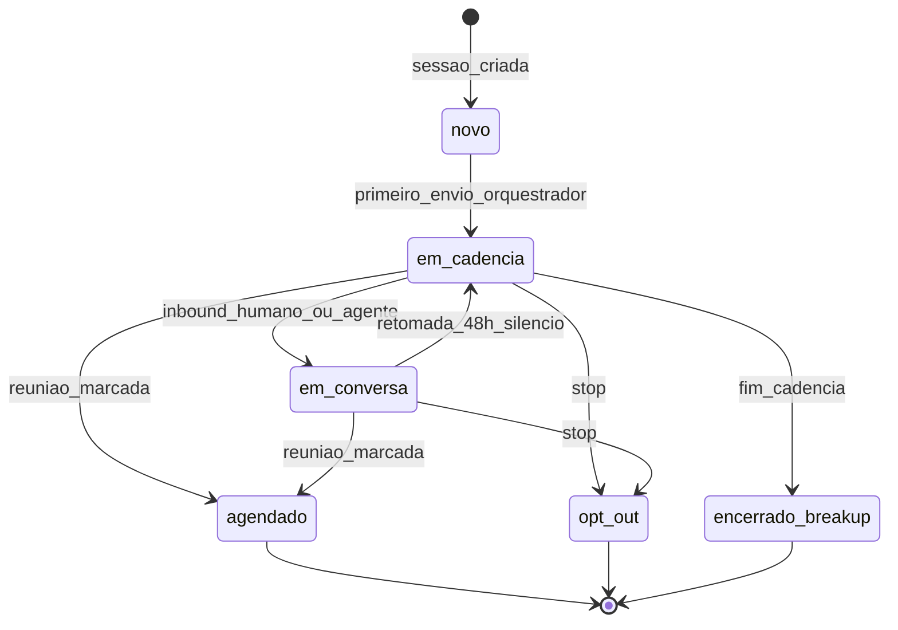
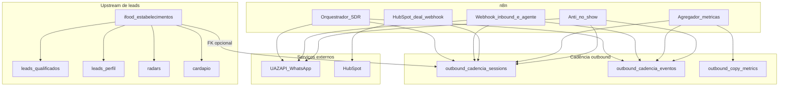
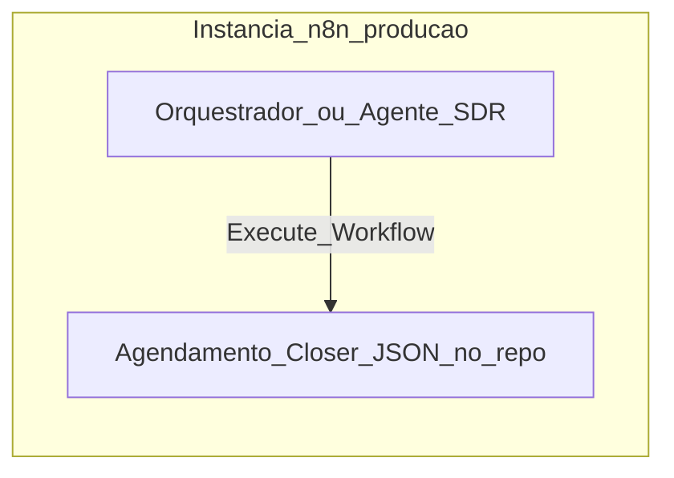

# Outbound NOLA — Arquitetura, fluxos e dados

Documento de referência única: **como o outbound se conecta** (n8n, Supabase, UAZAPI, HubSpot), **quais tabelas existem**, **que informação trafega** e **quais artefatos no repositório** descrevem cada parte.

**Escopo:** baseado no versionado em `supabase/migrations/`, `workflows/` e scripts na raiz do projeto. O **orquestrador principal do SDR** na instância n8n (`n8n.nola.com.br`) pode ter nós adicionais não exportados aqui; validar na UI quando for crítico.

**Inventários completos:** todos os workflows/subworkflows conhecidos — **seção 12**; todas as tabelas/views/objetos SQL e função — **seção 13**.

---

## 1. Sumário executivo

- **Fonte de verdade da conversa comercial** é o par `**outbound_cadencia_sessions`** (estado do lead na cadência) + `**outbound_cadencia_eventos**` (linha do tempo inbound/outbound).
- **Upstream** de dados vem do scrape iFood e enriquecimento (`ifood_estabelecimentos`, `leads_qualificados`, `leads_perfil`, `radars`), opcionalmente ligado à sessão por `ifood_estabelecimento_id`.
- **Visão consolidada** para prompts/queries: view `**v_sessao_completa`** (sessão + estabelecimento + perfil + radar).
- **Métricas agregadas** de copy: tabela `**outbound_copy_metrics`** (preenchida por job diário no n8n).
- **A/B de abertura D1 no WhatsApp:** coluna `abertura_variacao` nos eventos, função `next_d1_wa_variacao()`, view `v_d1_wa_variacao_metricas`.
- `**follow_up_tracking`** é um modelo **paralelo/legado** (session_id em texto); o fluxo principal usa UUID em `outbound_cadencia_sessions`.

### 1.1 Norte de produto e feed operacional

- **Meta:** conexão comercial de qualidade (atendimento NOLA como foco); radar, perfil, rapport e cadência são **meios**, não concorrentes entre si.
- **Feed principal de leads com perfil:** [`leads_perfil`](supabase/migrations/001_schema_leads.sql) (com vínculo a `leads_qualificados` / `ifood_estabelecimentos`). A **sessão** ativa de conversa/cadência continua sendo `outbound_cadencia_sessions` + `outbound_cadencia_eventos`.
- **Questionário de decisões:** preencher [`OUTBOUND_QUESTIONARIO_ESTRATEGICO.md`](OUTBOUND_QUESTIONARIO_ESTRATEGICO.md) para fechar regras (criação de sessão, duplicidade, quem envia após resposta).
- **Auditorias:** [`OUTBOUND_AUDIT_SUPABASE.md`](OUTBOUND_AUDIT_SUPABASE.md), [`OUTBOUND_AUDIT_N8N.md`](OUTBOUND_AUDIT_N8N.md); pendências técnicas: [`OUTBOUND_IMPL_MINIMA_PENDENTES.md`](OUTBOUND_IMPL_MINIMA_PENDENTES.md).

### 1.2 Máquina de estados e dono do próximo envio

**Regra de ouro:** por `session_id`, em um instante só pode haver um **dono** do próximo disparo imediato para o lead: **orquestrador (SDR Outbound)**, **agente (Outbound v2)** ou **ninguém** (pausa, opt-out, encerrado). Isso evita loops e rajadas quando dois fluxos escrevem no mesmo número.

| Situação | Quem pode enviar próxima mensagem automática (recomendação técnica) |
|----------|---------------------------------------------------------------------|
| Lead nunca respondeu; cadência ativa | Orquestrador (D1, reforço 1h, D+1 9h, próximos touchpoints WA) — com lease em DB (`015`). |
| Lead respondeu; `ultima_inbound_at` > `ultima_outbound_at` | Orquestrador **não** deve enfileirar (filtro no Code); agente trata resposta. |
| `em_conversa` + silêncio 48h | Orquestrador pode **retomar** cadência (regra já no filtro) — alinhar ao questionário se desejado. |
| Reunião agendada | Anti-no-show (lembretes) — não competir com cadência fria no mesmo estado operacional. |

Detalhes de implementação no repo: [`sdr-outbound-filtrar-vencidos.js`](../workflows/sdr-outbound-filtrar-vencidos.js), [`sdr-outbound-prepare-touchpoint.js`](../workflows/sdr-outbound-prepare-touchpoint.js), [`sdr-outbound-claim-dispatch-lease.js`](../workflows/sdr-outbound-claim-dispatch-lease.js).

---

## 2. Diagrama de contexto

---

## 3. Modelo de dados — tabelas

### 3.1 `ifood_estabelecimentos`

| Aspecto               | Detalhe                                                                                                                                                  |
| --------------------- | -------------------------------------------------------------------------------------------------------------------------------------------------------- |
| **Papel**             | Registro do restaurante vindo do scrape iFood; chave natural `ifood_url` única.                                                                          |
| **Campos relevantes** | `name`, `phone`, `cnpj`, endereço (`street_address`, `neighborhood`, `zipcode`), `rating`, `email`, `cuisine`, `price_range`, `regiao`, `classificacao`. |
| **Escrita**           | Scripts de scrape / `lib/supabaseLeads.js`.                                                                                                              |
| **Leitura**           | JOIN em `v_sessao_completa`; origem de `outbound_cadencia_sessions.ifood_estabelecimento_id`.                                                            |

**Migração:** `supabase/migrations/001_schema_leads.sql`.

---

### 3.2 `leads_qualificados`

| Aspecto     | Detalhe                                                                          |
| ----------- | -------------------------------------------------------------------------------- |
| **Papel**   | Um registro por estabelecimento quando há contato (telefone/e-mail) qualificado. |
| **Campos**  | `ifood_estabelecimento_id`, `phone`, `email`, `qualified_at`.                    |
| **Escrita** | Pipeline de qualificação.                                                        |
| **Leitura** | Enriquecimento upstream; não substitui o estado da cadência na sessão outbound.  |

**Migração:** `001_schema_leads.sql`.

---

### 3.3 `leads_perfil`

| Aspecto     | Detalhe                                                                                                           |
| ----------- | ----------------------------------------------------------------------------------------------------------------- |
| **Papel**   | Dados de Instagram / análise de perfil (rapport, punch line).                                                     |
| **Campos**  | `instagram_url`, `instagram_profile_url`, `seguidores`, `perfil_do_lead`, `punch_line`.                           |
| **Escrita** | Unificação Instagram / upserts em `lib/supabaseLeads.js`.                                                         |
| **Leitura** | `v_sessao_completa` (aliases `perfil_do_lead_perfil`, `rapport_perfil`, `seguidores_perfil`, `instagram_perfil`). |

**Migração:** `001_schema_leads.sql`.

---

### 3.4 `cardapio`

| Aspecto     | Detalhe                                                    |
| ----------- | ---------------------------------------------------------- |
| **Papel**   | Snapshot de cardápio (`payload` JSON) por estabelecimento. |
| **Escrita** | Scrape de menu.                                            |
| **Leitura** | Pouca ligação direta ao fluxo outbound no repo atual.      |

**Migração:** `001_schema_leads.sql`.

---

### 3.5 `radars`

| Aspecto     | Detalhe                                                                                                                                                 |
| ----------- | ------------------------------------------------------------------------------------------------------------------------------------------------------- |
| **Papel**   | Radar gerado por estabelecimento: PDF público, scores, textos para WhatsApp.                                                                            |
| **Campos**  | `pdf_url`, `slug`, `score_*`, oportunidade R$, `whatsapp_abertura`, `whatsapp_followup`; a partir da migração 007: `radar_enviado`, `radar_enviado_em`. |
| **Escrita** | Jobs de geração de Radar (`batchGenerateRadars.js`, etc.).                                                                                              |
| **Leitura** | `v_sessao_completa`; muitos campos são **copiados** para `outbound_cadencia_sessions` (denormalização para o agente).                                   |

**Migrações:** `003_create_radars_table.sql`, `007_radars_tracking_envio.sql`.

---

### 3.6 `outbound_cadencia_sessions`

| Aspecto                          | Detalhe                                                                                                                                                                                                                                                                                                                  |
| -------------------------------- | ------------------------------------------------------------------------------------------------------------------------------------------------------------------------------------------------------------------------------------------------------------------------------------------------------------------------ |
| **Papel**                        | **Estado único do lead** na máquina de cadência outbound (um registro por sessão UUID).                                                                                                                                                                                                                                  |
| **Identificação**                | `id` UUID; `phone` / `phone_e164`; opcional `ifood_estabelecimento_id`.                                                                                                                                                                                                                                                  |
| **Cadência**                     | `status` (`novo`, `em_cadencia`, `em_conversa`, `agendado`, `pausado`, `opt_out`, `perdido`, `encerrado_breakup`, …), `tier`, `angulo_copy`, `touchpoints_executados`, `ultimo_touchpoint_id`, `proximo_touchpoint_id`, `proximo_envio_at`, `cadencia_pausada`, `pausa_motivo`, `dia_referencia`, `primeiro_contato_at`. |
| **Sinais de engajamento**        | `ultima_inbound_at`, `ultima_outbound_at`, `lead_respondeu_alguma_vez`.                                                                                                                                                                                                                                                  |
| **Denormalizado (lead + radar)** | Nome, negócio, bairro, região, cuisine, rating, perfil Instagram, URLs, scores Radar, `radar_url`, BANT, `temperatura`, `conversa_fase`, `agendamento_at` / `agendamento_data` / `agendamento_link`, HubSpot ids, `metadata` JSONB.                                                                                      |
| **Escrita**                      | Orquestrador n8n, webhooks inbound, workflow HubSpot (deal + `status`), agente (campos de qualificação), migração de dedupe telefone.                                                                                                                                                                                    |
| **Leitura**                      | Orquestrador, anti-no-show, agregador de métricas, export, piloto, queries do agente.                                                                                                                                                                                                                                    |

**Migrações:** `005_outbound_cadencia_omnichannel.sql`, `006_add_ia_columns_outbound.sql` (e script `applyMigration006.js`), `011_phone_dedupe_and_unique.sql`.

---

### 3.7 `outbound_cadencia_eventos`

| Aspecto       | Detalhe                                                                                                                                                                                                                                                               |
| ------------- | --------------------------------------------------------------------------------------------------------------------------------------------------------------------------------------------------------------------------------------------------------------------- |
| **Papel**     | **Auditoria e timeline**: cada mensagem ou evento de canal (inbound/outbound).                                                                                                                                                                                        |
| **Campos**    | `session_id` FK, `touchpoint_id` (ex.: `D1_WA`, `LEAD_ENTRY`), `canal`, `formato`, `direcao` (`outbound` / `inbound`), `mensagem_texto`, `resumo`, `resultado` (ex.: `enviado`, `falha_envio`), `metadata` (erros UAZAPI, etc.), `n8n_execution_id`, `workflow_name`. |
| **Snapshots** | `temperatura_pos`, `conversa_fase_pos`, `agente_action`, colunas BANT por evento (quando usado).                                                                                                                                                                      |
| **A/B D1**    | `abertura_variacao` (1–3), migração `008_d1_wa_variacao_rotation.sql`.                                                                                                                                                                                                |
| **Escrita**   | Todo envio da cadência, respostas do agente, mensagens inbound, lembretes anti-no-show, falhas documentadas em `009_outbound_eventos_resultado_falha.sql`.                                                                                                            |
| **Leitura**   | Métricas diárias, view `v_d1_wa_variacao_metricas`, export de conversas.                                                                                                                                                                                              |

**Migrações:** `005`, `008`, `009`.

---

### 3.8 `outbound_copy_metrics`

| Aspecto     | Detalhe                                                                                                                            |
| ----------- | ---------------------------------------------------------------------------------------------------------------------------------- |
| **Papel**   | Agregados por **bucket de datas** e dimensões (`angulo_copy`, `formato`, `canal`, `tom`): `enviados`, `respostas`, `agendamentos`. |
| **Escrita** | Workflow **Agregador de Métricas Outbound** (`workflows/metrics-aggregator-workflow.json`), cron 22h.                              |
| **Leitura** | Análise de performance de copy / dashboards.                                                                                       |

**Migração:** `005_outbound_cadencia_omnichannel.sql`.

---

### 3.9 `follow_up_tracking` (legado / paralelo)

| Aspecto                | Detalhe                                                                                                                                   |
| ---------------------- | ----------------------------------------------------------------------------------------------------------------------------------------- |
| **Papel**              | Modelo alternativo com `session_id` **TEXT** (ex.: `chat_outbound_5511…`), `touchpoint` numérico, `attempts`, `lead_responded`, `status`. |
| **Relação com o core** | Não usa o mesmo identificador que `outbound_cadencia_sessions.id` (UUID). Pode coexistir com automações antigas.                          |
| **Leitura**            | `exportConversasSupabase.js` exporta CSV **se** a tabela existir e tiver linhas.                                                          |

**Migração:** `004_create_follow_up_tracking.sql`.

---

## 4. Views e funções SQL úteis

| Objeto                                                                    | Função                                                                                                                                                                                                          |
| ------------------------------------------------------------------------- | --------------------------------------------------------------------------------------------------------------------------------------------------------------------------------------------------------------- |
| `**v_sessao_completa`**                                                   | `outbound_cadencia_sessions` + LEFT JOIN `ifood_estabelecimentos`, `leads_perfil`, `radars` (inclui `radar_enviado` após migração 007). Uma query com contexto para IA ou validação. Recriada em 005, 006, 007. |
| `**next_d1_wa_variacao()**`                                               | Retorna 1, 2 ou 3 em sequência para rotação de copy do primeiro WhatsApp.                                                                                                                                       |
| `**v_d1_wa_variacao_metricas**` / `**d1_wa_variacao_metricas(from, to)**` | Métricas de resposta por variação de D1 (inbound no mesmo dia civil SP após o envio).                                                                                                                           |

**Arquivos:** `005`, `006`, `007`, `008`, `010_view_d1_wa_variacao_metricas.sql`.

---

## 5. Fluxos operacionais (etapas)

### F1 — Captação e enriquecimento (upstream)

1. Scrape grava/atualiza `ifood_estabelecimentos`.
2. Qualificação preenche `leads_qualificados`.
3. Instagram/unificação atualiza `leads_perfil`.
4. Opcional: `cardapio`.
5. Job de Radar grava/atualiza `radars` (e pode marcar envio depois).

**Referência:** `lib/supabaseLeads.js`, `001`, `003`, `007`.

---

### F2 — Criação e evolução da sessão outbound

1. Inserção de linha em `outbound_cadencia_sessions` (manual, import, ou workflow a partir do lead).
2. Preenchimento de `proximo_touchpoint_id` (ex.: `D1_WA`) e `proximo_envio_at`.
3. Transições de `status` e atualização de campos de cadência conforme respostas e regras de negócio.

**Referência:** `pilotValidateOutbound.js`, migrações 005/006/011.

---

### F3 — Orquestrador de cadência (n8n)

1. **Trigger** agendado — **15 min** no export [`sdr-outbound-workflow.json`](../workflows/sdr-outbound-workflow.json) (timezone `America/Sao_Paulo`); o modelo `n8n-cadencia-omnichannel-modelo.json` pode usar outro intervalo — tratar como referência de touchpoints, não como cron de produção.
2. **Seleção** de sessões com envio devido (filtros em índices da 005).
3. **Code** `sdr-outbound-prepare-touchpoint.js`: determina touchpoint, pula canais não suportados na v1 (email/LinkedIn/ligação sem dados), calcula próximo horário.
4. **Opcional:** RPC `next_d1_wa_variacao` para D1; persistir `abertura_variacao` no insert do evento.
5. Geração de mensagem (LLM) e envio HTTP **UAZAPI**.
6. **RPC** `try_claim_outbound_session` (migration **015**) antes de preparar o touchpoint; em falha de claim, pula para o próximo item do lote.
7. **INSERT** `outbound_cadencia_eventos` + **UPDATE** `outbound_cadencia_sessions` (inclui liberação de lease).

**Artefatos:** `workflows/n8n-cadencia-omnichannel-modelo.json` (modelo com **stub** até ligar ao orquestrador real), `workflows/sdr-outbound-workflow.json`, `workflows/sdr-outbound-prepare-touchpoint.js`, `workflows/sdr-outbound-filtrar-vencidos.js`, `workflows/sdr-outbound-claim-dispatch-lease.js`, `workflows/sdr-outbound-d1-wa-variacao.js`, `workflows/sdr-outbound-uazapi-falha-payload.js`, `workflows/sync-sdr-outbound-workflow.cjs`.

---

### F4 — Inbound e agente SDR

1. Webhook recebe mensagem (WhatsApp via UAZAPI).
2. Associação à `outbound_cadencia_sessions` e atualização de timestamps / flags.
3. Agente usa `PROMPT_SDR_OUTBOUND_NOLA.md`; saída é mensagem única para o lead.
4. Novos registros em `outbound_cadencia_eventos` (inbound + outbound).

**Referência:** prompt na raiz `PROMPT_SDR_OUTBOUND_NOLA.md`.

---

### F5 — Agendamento com closer

1. Sub-workflow disparado pelo agente com horários e identificação do lead.
2. Normalização, Redis (reagendamento), Google Calendar.
3. Resposta de disponibilidade ao agente.

**Artefato:** `agendamentoCloser.json`.  
**Problemas conhecidos:** `AGENDAMENTO_CLOSER_ANALISE_E_SUGESTOES.md` (ex.: derivar `available` a partir da lista de eventos).

**Persistência:** campos de agendamento na sessão são atualizados pelo fluxo que chama o closer (campos em `outbound_cadencia_sessions` na migração).

---

### F6 — HubSpot no agendamento (fora de uso)

O fluxo por webhook **não** é usado na operação: gerou instabilidade; o controle passou a ser **criar/editar leads HubSpot ao fim dos fluxos** (como no SDR outbound) e **ajustar fase no Agente Outbound v2**.

O arquivo `workflows/hubspot-deal-on-schedule-workflow.json` permanece no repositório só como **referência histórica** — **não** importar, acionar webhooks nem incluir em runbooks ou planos.

---

### F7 — Anti no-show

**Ramo D-1 (cron 8h):** seleciona sessões `agendado` com `agendamento_data` no dia seguinte; monta lembrete; UAZAPI; **INSERT** evento com `agente_action` anti-no-show.

**Ramo D0-30min (cron 30 min):** janela próxima à reunião; segundo lembrete; outro **INSERT** em eventos.

**Arquivo:** `workflows/anti-noshow-workflow.json`.

---

### F8 — Agregador de métricas (22h)

1. Calcula janela “hoje” em `America/Sao_Paulo`.
2. Lê eventos outbound/inbound do dia e sessões relevantes.
3. Agrega por canal (e outras dimensões no Code).
4. Escreve `outbound_copy_metrics`; pode enviar alerta via UAZAPI (configuração no mesmo workflow).

**Arquivo:** `workflows/metrics-aggregator-workflow.json`.

---

### F9 — Export para análise offline

1. Lê todas as linhas de `outbound_cadencia_sessions` e `outbound_cadencia_eventos` (com filtro opcional `--desde=`).
2. Gera `sessoes.csv`, `eventos.csv`, `conversas_long.csv`, `conversas_historico.csv`, `conversas_chat_por_sessao.csv`, `historico_conversas.md`, `conversas_threads.json`, `por_sessao/<uuid>.md`.
3. Opcional: `follow_up_tracking.csv`.

**Arquivo:** `exportConversasSupabase.js`.

---

### F10 — Validação em piloto

1. Aplicar migrações se necessário; inserir leads de teste em `outbound_cadencia_sessions`.
2. Verificar `v_sessao_completa` e eventos.

**Arquivo:** `pilotValidateOutbound.js`.

---

## 6. Matriz fluxo → tabelas / objetos SQL

| Fluxo             | Escreve                                                                              | Lê                                                                                            |
| ----------------- | ------------------------------------------------------------------------------------ | --------------------------------------------------------------------------------------------- |
| F1 upstream       | `ifood_estabelecimentos`, `leads_qualificados`, `leads_perfil`, `radars`, `cardapio` | —                                                                                             |
| F2 sessão         | `outbound_cadencia_sessions`                                                         | —                                                                                             |
| F3 orquestrador   | `outbound_cadencia_sessions`, `outbound_cadencia_eventos`                            | `outbound_cadencia_sessions`                                                                  |
| F4 inbound/agente | `outbound_cadencia_sessions`, `outbound_cadencia_eventos`                            | `outbound_cadencia_sessions` (e frequentemente contexto via `v_sessao_completa` na instância) |
| F5 closer         | (tipicamente sessão, fora do JSON do closer)                                         | —                                                                                             |
| F6 HubSpot (arquivado) | — (fluxo não operacional)                                                     | —                                                                                             |
| F7 anti-no-show   | `outbound_cadencia_eventos`                                                          | `outbound_cadencia_sessions`                                                                  |
| F8 métricas       | `outbound_copy_metrics`                                                              | `outbound_cadencia_eventos`, `outbound_cadencia_sessions`                                     |
| F9 export         | —                                                                                    | `outbound_cadencia_sessions`, `outbound_cadencia_eventos`, opcional `follow_up_tracking`      |
| F10 piloto        | test inserts                                                                         | `outbound_cadencia_sessions`, `outbound_cadencia_eventos`, `v_sessao_completa`                |

---

## 7. Workflows n8n (resumo no repositório)

Há **vários** JSON em `workflows/` (ver inventário detalhado em **§12.1** e em [`OUTBOUND_AUDIT_N8N.md`](OUTBOUND_AUDIT_N8N.md)). O `hubspot-deal-on-schedule-workflow.json` está **fora de uso** operacional (ver F6).

| Arquivo | Nome no n8n (campo `name`) |
|--------|----------------------------|
| `workflows/sdr-outbound-workflow.json` | SDR Outbound (orquestrador produção) |
| `workflows/n8n-cadencia-omnichannel-modelo.json` | Cadência Omnichannel — modelo (divisão D1–D21) |
| `workflows/metrics-aggregator-workflow.json` | Agregador de Métricas Outbound |
| `workflows/anti-noshow-workflow.json` | Anti No-Show — Lembretes |
| `workflows/inbound-lead-entry-outbound-cadencia-workflow.json` | Inbound Lead Entry |
| `workflows/agrupar-mensagens-recebidas-workflow.json` | Agrupar Mensagens Recebidas (subfluxo) |
| `agendamentoCloser.json` (raiz, se presente) | Agendamento Closer |

**Monitoramento da instância (só documentado, sem JSON no repo):** `MONITOR_N8N_EXECUCOES_SLACK.md`.

---

## 8. Scripts e bibliotecas relacionados

| Caminho                                          | Uso                                                                       |
| ------------------------------------------------ | ------------------------------------------------------------------------- |
| `exportConversasSupabase.js`                     | Export CSV/MD/JSON das conversas.                                         |
| `pilotValidateOutbound.js`                       | Testes de sessão, eventos e view.                                         |
| `applyMigration006.js`                           | Ajudar a aplicar colunas IA (DDL manual no Dashboard se RPC não existir). |
| `lib/supabaseLeads.js`                           | Upsert de estabelecimentos, leads qualificados, perfil, radars.           |
| `workflows/sdr-outbound-prepare-touchpoint.js`   | Colar no nó Code do n8n.                                                  |
| `workflows/sdr-outbound-d1-wa-variacao.js`       | Suporte a métricas/variação D1.                                           |
| `workflows/sdr-outbound-uazapi-falha-payload.js` | Tratamento de falha UAZAPI.                                               |

---

## 9. Prioridade sugerida para “fluxos redondos”

1. **Dados:** migração `011` aplicada; evitar múltiplas sessões ativas para o mesmo telefone normalizado.
2. **Core WhatsApp:** ciclo D1 (e próximo TP WA usado) — envio → evento → inbound → atualização de sessão → resposta do agente sem rajadas duplicadas.
3. **Cadência pausada** durante `em_conversa`, conforme regras de negócio.
4. **Agendamento closer** alinhado à disponibilidade real (correções em `AGENDAMENTO_CLOSER_ANALISE_E_SUGESTOES.md`).
5. **Métricas** batendo com a operação (fuso e definição de “resposta”).
6. **Expansão omnichannel** (e-mail, LinkedIn, ligação) depois que o núcleo WA estiver estável.

---

## 10. Privacidade e compliance

Exports e a tabela de sessões contêm **telefone, nome e conteúdo de mensagens**. Tratar como dado sensível; não versionar exports completos no Git; restringir compartilhamento.

---

## 11. Referência rápida de migrações

| Arquivo                                    | Conteúdo                                                                   |
| ------------------------------------------ | -------------------------------------------------------------------------- |
| `001_schema_leads.sql`                     | `ifood_estabelecimentos`, `leads_qualificados`, `leads_perfil`, `cardapio` |
| `002_`*                                    | Endereços relevantes / classificação (paralelo ao scrape)                  |
| `003_create_radars_table.sql`              | `radars`                                                                   |
| `004_create_follow_up_tracking.sql`        | `follow_up_tracking`                                                       |
| `005_outbound_cadencia_omnichannel.sql`    | Sessões, eventos, métricas, `v_sessao_completa`                            |
| `006_add_ia_columns_outbound.sql`          | Colunas IA (sessão e eventos)                                              |
| `007_radars_tracking_envio.sql`            | Flags de envio do radar + view                                             |
| `008_d1_wa_variacao_rotation.sql`          | Sequência e coluna `abertura_variacao`                                     |
| `009_outbound_eventos_resultado_falha.sql` | Comentários `resultado` / `metadata`                                       |
| `010_view_d1_wa_variacao_metricas.sql`     | View e função de métricas D1                                               |
| `011_phone_dedupe_and_unique.sql`          | Normalização, fusão, unicidade por telefone                                |
| `012_followup_contract_and_leads_perfil_principal.sql` | Contrato follow-up 1h / D+1 9h; colunas em sessão e eventos |
| `013_primeiros_horarios_e_metrica_por_hora.sql` | Horários/métricas (se aplicável ao projeto) |
| `014_d1_abertura_variacao_session.sql` / `014_drop_extra_triggers_*` | Variação D1 na sessão; limpeza de triggers |
| `015_outbound_dispatch_lease.sql`        | Lease de disparo; RPC `try_claim_outbound_session` / `release_outbound_dispatch_lease` |

---

## 12. Inventário completo: workflows e subworkflows

### 12.1 Workflows com JSON versionado no Git

| Nome no n8n | Arquivo | Função | Tipo |
|-------------|---------|--------|------|
| **Cadência Omnichannel — modelo (divisão D1–D21)** | `workflows/n8n-cadencia-omnichannel-modelo.json` | Define em Code o mapa de touchpoints D1–D21; Schedule (**45 min** no modelo); stub “ligar orquestrador”. Serve de **modelo** para importar/colar na instância — **não** é o orquestrador de produção completo. | Fluxo **standalone** (sem `Execute Workflow` outbound no JSON). |
| **Agregador de Métricas Outbound** | `workflows/metrics-aggregator-workflow.json` | Cron 22h; janela “hoje” SP; lê `outbound_cadencia_eventos` e sessões; agrega; grava `outbound_copy_metrics`; pode notificar (UAZAPI no mesmo arquivo). | Fluxo **standalone**. |
| **Anti No-Show — Lembretes** | `workflows/anti-noshow-workflow.json` | Dois crons: 8h (D-1) e 30 min (janela pré-reunião); lê sessões `agendado`; envia WA via UAZAPI; insere `outbound_cadencia_eventos`. | Fluxo **standalone**. |
| **SDR Outbound** | `workflows/sdr-outbound-workflow.json` | Orquestrador de produção: Schedule **15 min**, timezone SP; lê `v_sessao_completa`; claim lease (015); `sdr-outbound-prepare-touchpoint.js`; Agent; UAZAPI; Supabase. `UAZAPI_TOKEN` via env. | Fluxo **standalone**. |
| **Inbound Lead Entry — Outbound Cadência** | `workflows/inbound-lead-entry-outbound-cadencia-workflow.json` | Entrada de lead na cadência / criação de sessão. | Fluxo **standalone** (webhook típico). |
| **Agrupar Mensagens Recebidas** | `workflows/agrupar-mensagens-recebidas-workflow.json` | Subfluxo: buffer Redis, debounce inbound para o agente. | **Sub-workflow** (`executeWorkflowTrigger`). |
| **Agendamento Closer** | `agendamentoCloser.json` (raiz) | Normaliza input; Redis (reagendamento); Google Calendar; cria/atualiza eventos; resposta ao chamador. ID no export: `NPZIsry7lCS4DHzD`. | **Sub-workflow**: primeiro nó é `executeWorkflowTrigger` (“When Executed by Another Workflow”) — **é chamado** por outro workflow, não inicia sozinho por trigger de produção típico. |

| **HubSpot — Criar Deal no Agendamento** *(arquivado — não operacional)* | `workflows/hubspot-deal-on-schedule-workflow.json` | Mantido só no Git como histórico; **não** acionar na instância. | Não incluir em rollout. |

### 12.2 Sub-workflows (relação de execução)

- **Único sub-workflow explícito no repositório:** **Agendamento Closer** — disparado pelo nó **Execute Workflow** de um fluxo pai (tipicamente o **agente SDR** ou fluxo que trata agendamento após qualificação). Entradas esperadas incluem `nome`, `horario_inicio`, `horario_fim`, `email`, `resumo`, `id_event` (ver nó trigger no JSON).
- Vários JSONs standalone **não** usam `executeWorkflowTrigger` (Cadência modelo, Agregador, Anti no-show, **SDR Outbound**); outros usam Webhook (**Inbound Lead Entry**, etc.). O JSON HubSpot agendamento não conta como fluxo ativo.

### 12.3 Workflows só na instância (documentados, sem export no repo)

| Nome | ID (instância) | Função |
|------|----------------|--------|
| **Monitor Execuções n8n → Slack** | `fdS4tsplf9S5od9r` | A cada 1 min lista execuções via API n8n; alerta Slack se pico de execuções ou execução longa (>3 min). Não toca Supabase outbound diretamente. |

Fonte: `MONITOR_N8N_EXECUCOES_SLACK.md`. Instância: `https://n8n.nola.com.br/`.

### 12.4 Workflows só na instância (conceito ou sem export no Git)

O **SDR Outbound** de produção está versionado em **`workflows/sdr-outbound-workflow.json`** (§12.1). Os itens abaixo são outros fluxos da arquitetura (`Plano_Construcao_Agente_SDR.md`, operação real) **sem** arquivo `.json` dedicado neste repositório:

| Nome conceitual | Função típica |
|-----------------|----------------|
| **Webhook inbound WhatsApp** | Recebe eventos UAZAPI; associa sessão; grava inbound; dispara agente. |
| **Agente IA (SDR outbound)** *(trechos no repo)* | OpenAI / nó Agent; aplica `PROMPT_SDR_OUTBOUND_NOLA.md`; pode chamar **Execute Workflow → Agendamento Closer** e webhooks auxiliares. O workflow completo do agente pode estar só na instância. |
| **Motor de contexto / enriquecimento** | Opcional: fluxos que preenchem lead antes de entrar na cadência. |

Para inventário fechado na instância: exportar cada workflow adicional pela UI n8n (Settings → Download) e versionar em `workflows/` quando fizer sentido.

### 12.5 Biblioteca de Code (não é workflow)

Arquivos em `workflows/*.js` são trechos para colar em nós **Code** dentro de workflows: `sdr-outbound-filtrar-vencidos.js`, `sdr-outbound-prepare-touchpoint.js`, `sdr-outbound-claim-dispatch-lease.js`, `sdr-outbound-d1-wa-variacao.js`, `sdr-outbound-uazapi-falha-payload.js`, `outbound-v2-merge-classificacao-ia.js`, `calcular-periodo-metricas.js`, `agregar-metricas-code.js`, `apply-metrics-workflow-code.mjs`. Sincronização do JSON do orquestrador: `sync-sdr-outbound-workflow.cjs`.

### 12.6 Diagrama pai → sub-workflow (o que o repo prova)

---

## 13. Inventário completo: tabelas, views e objetos SQL (função)

Todas as **tabelas** abaixo vêm das migrações em `supabase/migrations/`. **Função** = papel no ecossistema outbound e leads.

### 13.1 Tabelas

| Tabela | Função |
|--------|--------|
| **`ifood_estabelecimentos`** | Cadastro mestre do restaurante no iFood (URL única, nome, endereço, rating, telefone bruto, região, classificação, etc.). Base do FK para qualificação, perfil e radar. |
| **`leads_qualificados`** | Um registro por estabelecimento quando existe contato utilizável (telefone/e-mail); liga `ifood_estabelecimento_id` ao canal. |
| **`leads_perfil`** | Enriquecimento Instagram: URLs, `perfil_do_lead`, `punch_line`, seguidores — usado em unificação e na view de sessão completa. |
| **`cardapio`** | Snapshot opcional do cardápio (`payload` JSON) por estabelecimento. |
| **`relevant_addresses`** | Endereços/coordenadas para scrape regional (não é estado de cadência; apoio a `run-scrapes` / mapas). |
| **`radars`** | Radar gerado: PDF, slug, scores, oportunidade R$, textos WA; flags `radar_enviado` / `radar_enviado_em` (migração 007). |
| **`follow_up_tracking`** | Modelo **legado/paralelo** de follow-up (`session_id` texto, touchpoint numérico). Pode coexistir com automações antigas; export opcional em `exportConversasSupabase.js`. |
| **`outbound_cadencia_sessions`** | **Estado da sessão outbound**: identidade, cadência (status, touchpoints, próximo envio), denormalização lead/radar, BANT, agendamento, HubSpot, `metadata`; colunas de lease de disparo (`outbound_dispatch_*`, migração 015). |
| **`outbound_cadencia_eventos`** | **Linha do tempo**: cada mensagem/evento inbound ou outbound, touchpoint, canal, texto, resultado, A/B `abertura_variacao`, snapshots IA, `metadata` (falhas UAZAPI). |
| **`outbound_copy_metrics`** | **Agregados** por bucket de datas e dimensões (canal, `angulo_copy`, etc.): contagens de enviados, respostas, agendamentos. |

### 13.2 Views

| View | Função |
|------|--------|
| **`v_sessao_completa`** | Junta `outbound_cadencia_sessions` + `ifood_estabelecimentos` + `leads_perfil` + `radars` em uma linha para prompts e consultas (inclui aliases de perfil e radar). |
| **`v_d1_wa_variacao_metricas`** | Métricas de resposta por variação de copy D1 (1–3), alinhada à lógica da função `d1_wa_variacao_metricas`. |

### 13.3 Funções e sequência (não são tabelas)

| Objeto | Função |
|--------|--------|
| **`next_d1_wa_variacao()`** | Retorna próxima variação 1–3 para rotação global de copy D1_WA (migração 008). |
| **`try_claim_outbound_session` / `release_outbound_dispatch_lease`** | Reserva/libera envio por sessão para o orquestrador (migração 015). |
| **`d1_wa_variacao_metricas(from, to)`** | Tabela retornada com métricas D1 por variação em janela de tempo (migração 010). |
| **`phone_digits_normalized(text)`** (011) | Normaliza telefone para dígitos; usado em dedupe e índices únicos. |
| **Sequência `outbound_d1_wa_var_seq`** | Alimenta a rotação de `next_d1_wa_variacao`. |

### 13.4 Matriz rápida: objeto → principal consumidor

| Objeto | Scripts / workflows que mais usam |
|--------|-----------------------------------|
| `outbound_cadencia_sessions` | Orquestrador (instância), inbound, anti-no-show, métricas, export, piloto (HubSpot por webhook de agendamento não operacional) |
| `outbound_cadencia_eventos` | Orquestrador, inbound, anti-no-show, métricas, export |
| `outbound_copy_metrics` | Agregador de métricas (workflow JSON) |
| `ifood_estabelecimentos` / `leads_*` / `radars` | `lib/supabaseLeads.js`, scrapes, `v_sessao_completa` |
| `follow_up_tracking` | Só export se existir dados |
| Views D1 | BI, `metrics-aggregator` (lógica espelhada no Code), SQL direto |

---

