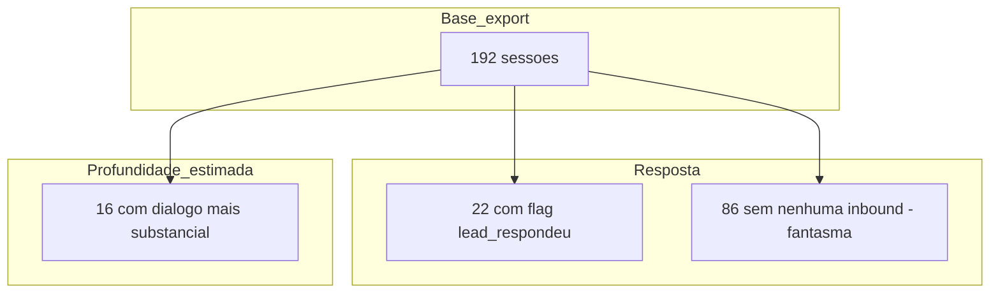
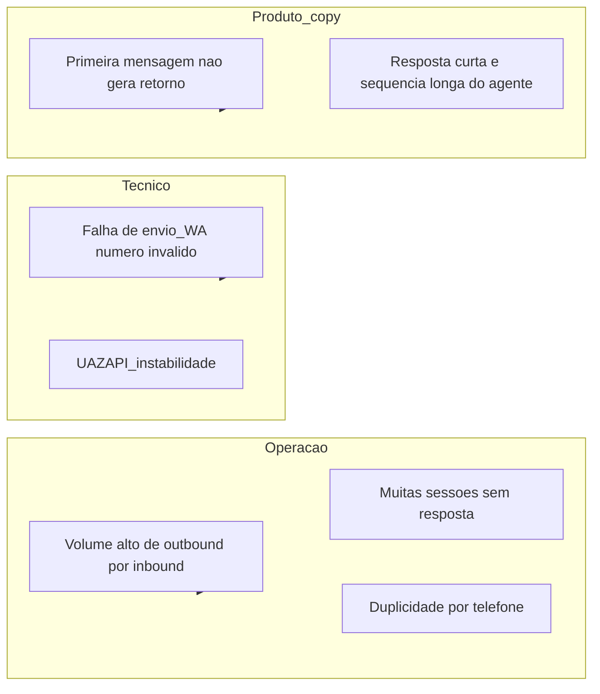

# Diagnóstico de tração outbound — visão cruzada (dados + arquitetura)

**Fonte dos números:** export em [`conversas/conversas_threads.json`](../conversas/conversas_threads.json) (mesmo conjunto descrito em [`OUTBOUND_ARQUITETURA_E_FLUXOS.md`](OUTBOUND_ARQUITETURA_E_FLUXOS.md): sessões e eventos vêm de `outbound_cadencia_sessions` / `outbound_cadencia_eventos`).

**Escopo:** snapshot analisado no repositório (192 sessões, 525 mensagens). Para operação atual, rode de novo `node exportConversasSupabase.js` e substitua o JSON ou recalcule.

---

## 1. Indicadores principais (o que os dados mostram)

| Indicador | Valor | Leitura rápida |
|-----------|------:|----------------|
| Sessões | 192 | Base do recorte |
| Mensagens totais | 525 | Volume de eventos registrados |
| **Outbound / Inbound** | **425 / 100** | **~4,3 mensagens do agente para cada 1 do lead** — conversa muito assimétrica |
| `lead_respondeu_alguma_vez` (flag) | 22 / 192 (**11,5%**) | Poucos leads entram em diálogo de fato |
| **Sessões “fantasma”** (heurística) | **86 (44,8%)** | Pelo menos 1 outbound “real” após `LEAD_ENTRY` e **nenhuma** inbound — silêncio total |
| **Engajamento simples** (heurística) | **16 (8,3%)** | ≥2 inbound **ou** 1 inbound com texto mais longo (>25 caracteres) |
| **“Esfriamento”** (heurística) | **2 (1,0%)** | Poucas respostas curtas e ainda vários outbound — poucos casos no recorte |
| Números com **>1 sessão** | **8 telefones** | Risco de duplicidade / ruído (ver migração `011` e doc de arquitetura) |

**Heurísticas usadas**

- **Outbound “real”:** exclui `LEAD_ENTRY` / canal `system` (só sistema, não cadência).
- **Fantasma:** `inbound === 0` e pelo menos um outbound real.
- **Engajamento:** proxy de conversa com substância, não só “oi/sim”.

---

## 2. Funil visual (sessão → resposta → profundidade)

Valores absolutos aproximados para leitura executiva.



**Interpretação cruzada com o modelo de dados**

- Estados em `outbound_cadencia_sessions`: neste export, **85 `novo`**, **88 `em_cadencia`**, **19 `em_conversa`** — grande parte ainda em **pipelines frios** (`novo` / `em_cadencia`), coerente com taxa baixa de resposta.
- O desequilíbrio **425 outbound vs 100 inbound** combina: (1) **cadência** gerando vários toques por lead, (2) **agente** com múltiplas mensagens após uma resposta curta, (3) **LEAD_ENTRY** e touchpoints contando como outbound.

---

## 3. Distribuição de outbound por `touchpoint_id`

| Touchpoint | Contagem outbound | Função no desenho |
|------------|------------------:|-------------------|
| `LEAD_ENTRY` | 190 | Entrada automática na base — não é copy de prospecção |
| `D1_WA` | 107 | Primeira mensagem WhatsApp da cadência |
| *(sem touchpoint)* | 93 | Tipicamente **conversa IA** ou envios sem TP gravado — revisar consistência no n8n |
| `D3_WA` | 24 | Follow-up D3 |
| `D7_WA` | 11 | Áudio / passo D7 |

**Tensão aparente:** muitas linhas **sem `touchpoint_id`** nas mensagens pós-abertura — vale alinhar gravação no fluxo para métricas (`outbound_copy_metrics`, view D1) e para saber *o que* puxa ou não tração.

---

## 4. O que tira tração — mapa de causas (dados + arquitetura)



| Causa | Evidência no recorte | Onde isso aparece na arquitetura |
|-------|----------------------|----------------------------------|
| Assimetria mensagens | Ratio **4,25 : 1** | Cadência + agente (`outbound_cadencia_eventos`); prompt pede mensagens curtas — conferir se o fluxo respeita após “oi/sim” |
| Silêncio absoluto | **~45%** “fantasma” | Leads em `novo`/`em_cadencia`; warm-up WA / timing / segmento |
| Baixa taxa de resposta | **11,5%** com flag | Mesma ordem de grandeza que funil frio em outbound B2B típico; comparar com `v_d1_wa_variacao_metricas` por variação de copy |
| Entrega | Poucas `falha_envio` no CSV de eventos (amostra com erro de número / 500) | `resultado` + `metadata` em `outbound_cadencia_eventos` ([`009` migration](../supabase/migrations/009_outbound_eventos_resultado_falha.sql)) |
| Duplicidade | 8 números com >1 sessão | [`011_phone_dedupe_and_unique.sql`](../supabase/migrations/011_phone_dedupe_and_unique.sql); pode diluir esforço e confundir o lead |

---

## 5. Métodos para melhorar a conexão (prioridade sugerida)

1. **Medir D1 com disciplina** — Garantir `touchpoint_id` + `abertura_variacao` em todo envio D1; comparar taxas na view `v_d1_wa_variacao_metricas` e no agregador. *Objetivo:* saber qual abertura sustenta resposta no mesmo dia.
2. **Reduzir assimetria após primeira resposta** — No agente, espelhar comprimento (já no prompt SDR): após “oi/sim”, **uma** pergunta curta antes de segundo bloco. *Objetivo:* subir engajamento sem parecer robô.
3. **Endereçar fantasma antes de empilhar TP** — Regra de negócio: não avançar D3/D7 no mesmo lead se D1 não teve entrega confirmada ou se canal está com falha recorrente. *Objetivo:* menos outbound “no vácuo”.
4. **Unicidade por telefone** — Aplicar/validar `011`; no n8n, não criar segunda sessão ativa para o mesmo `phone` normalizado. *Objetivo:* uma conversa por número, menos ruído.
5. **Warm-up e volume** — Alinhar com [`Plano_Cadencia_Omnichannel_Detalhado.md`](../Plano_Cadencia_Omnichannel_Detalhado.md) (limites diários, intervalos). *Objetivo:* menos risco de bloqueio e melhor percepção humana.
6. **Qualificação de número** — Tratar `falha_envio` + metadata (`not on WhatsApp`) com lista de limpeza ou revalidação antes de gastar touchpoints. *Objetivo:* foco em contatos entregáveis.

---

## 6. Script de análise (reprodutível)

Arquivo: [`scripts/analyzeConversasTraction.js`](../scripts/analyzeConversasTraction.js) — lê `conversas/conversas_threads.json` (ou outro caminho), imprime métricas JSON no stdout e pode gerar **HTML** e **JSON** de saída.

```bash
# Métricas no terminal (JSON)
npm run analyze:conversas

# Ou com caminho customizado
node scripts/analyzeConversasTraction.js ./pasta/conversas_threads.json

# Relatório HTML + métricas em arquivo (sobrescreve os paths abaixo)
npm run analyze:conversas:report
# equivalente a:
node scripts/analyzeConversasTraction.js --html docs/conversas-tracao-report.html --json docs/conversas-tracao-metrics.json
```

- Abra `docs/conversas-tracao-report.html` no navegador para ver KPIs, barras das heurísticas e tabelas.
- `--quiet` suprime o JSON no stdout quando só quer gerar arquivos.

**Fluxo sugerido:** (1) `node exportConversasSupabase.js ./conversas --desde=YYYY-MM-DD` → (2) `npm run analyze:conversas:report` → (3) opcional: SQL no Supabase `SELECT status, COUNT(*) FROM outbound_cadencia_sessions GROUP BY 1` → (4) leitura qualitativa em `conversas/por_sessao/*.md`.

### 6.1 Análise profunda (contactados, 1ª resposta por touchpoint, pós-Radar)

Arquivo: [`scripts/analyzeConversasDeep.js`](../scripts/analyzeConversasDeep.js).

- **Contactado** = pelo menos um outbound real (não `LEAD_ENTRY`) com entrega válida (`resultado` ≠ `falha_envio`). Quem nunca recebeu mensagem de cadência entregue **não entra** no denominador principal.
- **Touchpoint na 1ª resposta** = `touchpoint_id` do último outbound **de cadência** (ignora `LEAD_ENTRY`) imediatamente antes do primeiro inbound.
- **Radar** = primeiro outbound (real) cujo texto casa com `\bradar\b` (case insensitive). Opcionalmente cruza com `conversas/sessoes.csv` (`radar_url`, `conversa_fase`) por `session_id`.
- **Parada após Radar** = snapshot do último evento da thread depois desse primeiro outbound “tipo Radar” (último outbound = lead ainda não respondeu depois; último inbound = lead falou por último no recorte).
- **Modelos de abertura** = texto do **primeiro outbound real entregue** na sessão (o que o lead de fato recebeu primeiro). O relatório agrupa cópias parecidas (normalização + anonimização de região/nome) e aplica **tags heurísticas** no texto (ex.: CTA de envio, “recorte/estudo”, pergunta de interlocutor). Cada tag mostra taxa de resposta entre contactados **com aquela característica** e **Δ em pontos percentuais vs a taxa global do cohort** — útil para comparar estilos, mas não implica causalidade (segmentos se sobrepõem).

```bash
npm run analyze:conversas:deep

# equivalente:
node scripts/analyzeConversasDeep.js \
  --html docs/conversas-tracao-deep-report.html \
  --json docs/conversas-tracao-deep-metrics.json \
  --sessoes conversas/sessoes.csv
```

Saídas: `docs/conversas-tracao-deep-report.html` (navegador) e `docs/conversas-tracao-deep-metrics.json` (inclui array `per_session` para auditoria). Sem `--sessoes`, o cruzamento com `radar_url` fica omitido.

---

## 7. Limitações

- **Heurísticas** não substituem leitura qualitativa das conversas.
- **Flag** `lead_respondeu_alguma_vez` pode divergir de contagem manual de inbound (regras de atualização no n8n).
- **Snapshot** fixo no Git envelhece; números acima são os do arquivo atual em `conversas/`.

---

*Documento de apoio à decisão; atualizar após novo export ou mudança nos workflows.*
